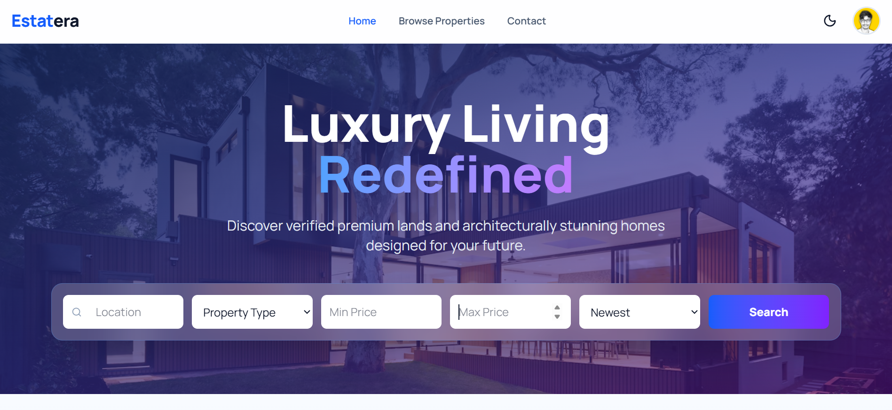

# 🏰 Estatera — Luxury Living Redefined

  

  <a href="https://estatera.onrender.com"><strong>🌐 Live Demo</strong></a>

**Estatera** is an elite, full-stack real estate ecosystem designed for high-net-worth investors and premium property seekers. Combining a cinematic front-end experience with a robust executive administrative suite, Estatera streamlines the journey from property discovery to legal acquisition.

---

## ✨ World-Class Features

### 🏢 Premium Property Ecosystem

- **Cinematic Discovery:** High-performance bento-grid (Desktop) and swipe-gallery (Mobile) media displays for immersive architectural viewing.
- **Interactive Cartography:** Precision geolocation using LocationIQ and Leaflet, allowing users to explore land boundaries and neighborhood contexts.
- **Dynamic PDF Brochure Engine:** Instant, client-side generation of professional "Fact Sheets" using `jsPDF` for offline viewing.
- **Intelligent Search:** Advanced multi-filter logic including Geospatial radius search, price thresholds, and categorized property types.

### 👔 Executive Administrative Suite (BI)

- **Business Intelligence Dashboard:** Real-time analytics powered by `Recharts` visualizing revenue trends, inventory share, and property popularity.
- **Automated Marketing Engine:** Automated property alerts via Brevo API using personalized HTML templates.
- **Community Governance:** Full user lifecycle management including a "Security Heartbeat" that terminates blocked sessions in real-time.
- **Intelligence Reports:** One-click export of business performance data to CSV and professional-grade PDF formats.

### 🛡️ Enterprise-Grade Infrastructure

- **PWA Architecture:** Fully installable mobile experience with custom Service Workers for "App-like" performance and standalone UI.
- **Security First:** JWT-based authentication, "Master Admin" account protection protocols, and real-time status synchronization.
- **Global Readiness:** Multi-language support (English, Tamil, Hindi) using **Lingui i18n** for international market reach.
- **SEO & Social Mastery:** Advanced **JSON-LD Structured Data** and optimized Open Graph/WhatsApp metadata for "Gold Standard" search engine visibility.

---

## 🚀 Tech Stack

| Layer         | Technologies                                                               |
| :------------ | :------------------------------------------------------------------------- |
| **Frontend**  | React 19, Vite, Tailwind CSS 4, Framer Motion, Axios, Lingui i18n          |
| **Backend**   | Node.js, Express 5, Socket.io (Real-time Events), JWT                      |
| **Database**  | MongoDB (Mongoose ODM)                                                     |
| **Cloud/API** | Cloudinary (Media), Brevo (Email API), LocationIQ (Maps), Render (Hosting) |

---

## 🧩 System Architecture

- Client → React (PWA)
- API → Express + JWT Auth
- Real-time → Socket.io
- Storage → MongoDB + Cloudinary

---

## 📈 Performance Engineering

**Network Optimization**: Utilizes family: 4 forced IPv4 routing for high-reliability cloud deployment on Render.
**Efficient Rendering**: Memoized financial calculations and staggered Framer Motion animations to ensure 60fps UI performance.
**Smart Caching**: Service Worker implementation for asset caching and "Network-first" API strategies.

---

## 🗺️ Roadmap

- [ ] AI-Powered property value appreciation estimator
- [ ] 360° Virtual Reality property tours using WebGL
- [ ] In-app secure document vault and e-signature integration
- [ ] Direct agent-to-user live chat via Socket.io

---

## 👨‍💻 Author

  
  

---

  Estatera — Architecture is the background of life.

